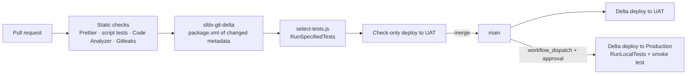

# Salesforce DevOps Pipeline Template

A GitHub Actions CI/CD template for Salesforce DX projects: static checks and secret scanning on every pull request, check-only **delta** validation against UAT with **automatically selected Apex tests**, and gated delta deploys to UAT and production.

> **Representative portfolio project.** An independent template built with public tooling (Salesforce CLI, sfdx-git-delta, Salesforce Code Analyzer, Gitleaks). It does not reproduce any employer's or client's pipeline.

## Business problem

Salesforce teams that deploy with change sets or full-org deploys hit the same issues: long validation runs because every test executes, surprises in production because nothing was validated against a realistic org, and credentials pasted into CI settings. This template shows a pipeline that is fast on pull requests and strict on production.

## Pipeline



| File | Role |
|---|---|
| `.github/workflows/pr-validate.yml` | PR checks and check-only delta validation against UAT |
| `.github/workflows/deploy.yml` | Delta deploy to UAT on merge; approved, fully tested deploy to production |
| `scripts/select-tests.js` | Maps changed classes/triggers to Apex tests (naming convention + reference scan), falls back to `RunLocalTests` when unsure |
| `scripts/smoke-test.apex` | Post-deploy sanity check |
| `docs/branching-strategy.md` | Branch model and release rules |
| `docs/github-setup.md` | JWT Connected App and GitHub Environments setup |

## Test selection example

```bash
$ printf 'force-app/main/default/classes/SampleService.cls\n' | node scripts/select-tests.js
{"testLevel":"RunSpecifiedTests","tests":["SampleServiceTest"],"reason":"All changes mapped"}
```

## Run locally

```bash
npm install
npm run test:scripts     # 8 tests for the test-selection logic
npm run lint:format
```

## Security considerations

- Org authentication uses the JWT bearer flow; the private key lives only in GitHub encrypted secrets and is deleted from the runner after login.
- Production is a protected GitHub Environment with required reviewers.
- Gitleaks blocks commits containing secrets; `.gitignore` excludes `*.key` and `.env`.
- The integration user should have only the permissions needed to deploy metadata.

## Limitations and future enhancements

- Reference scanning is text-based; dynamic references (e.g. `Type.forName`) are not detected, which is why the script falls back to `RunLocalTests` when nothing maps.
- Future: scratch-org pooling for PR tests, LWC Jest and coverage gates per package, Slack notifications, and quick-deploy of the validated PR ID into production.

## License

MIT – see [LICENSE](LICENSE).
