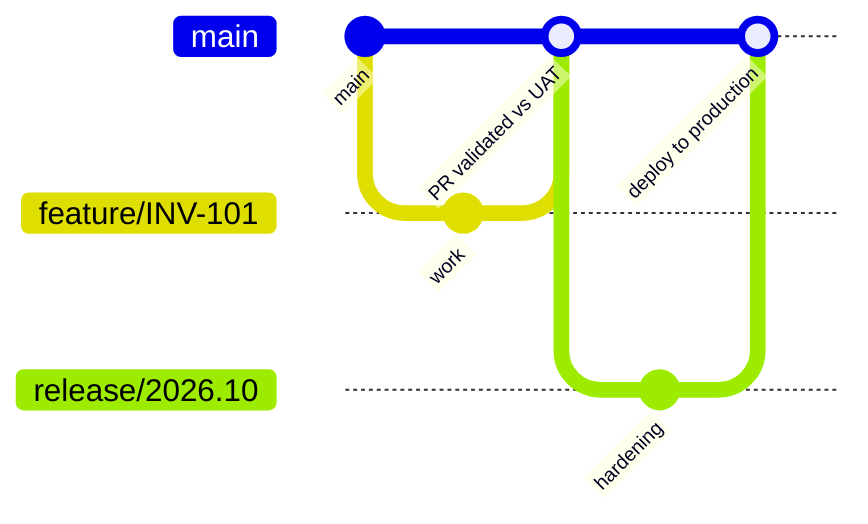

# Branching and release strategy

| Branch | Purpose | Automation |
|---|---|---|
| `feature/*` | One user story per branch | PR validation: formatting, script tests, Code Analyzer, secret scan, check-only delta deploy to UAT with selected tests |
| `main` | Integrated, UAT-deployed code | Delta deploy to UAT on every merge |
| `release/*` | Release hardening | Manual `workflow_dispatch` to production (environment approval required, RunLocalTests) |

Rules

- Every change reaches production through a pull request with at least one reviewer.
- Destructive changes are generated by `sfdx-git-delta` and reviewed in the PR diff.
- Production deploys always run local tests; the org's 75% coverage rule is the floor, not the target.
- Hotfixes branch from the production tag, then merge back into `main`.
